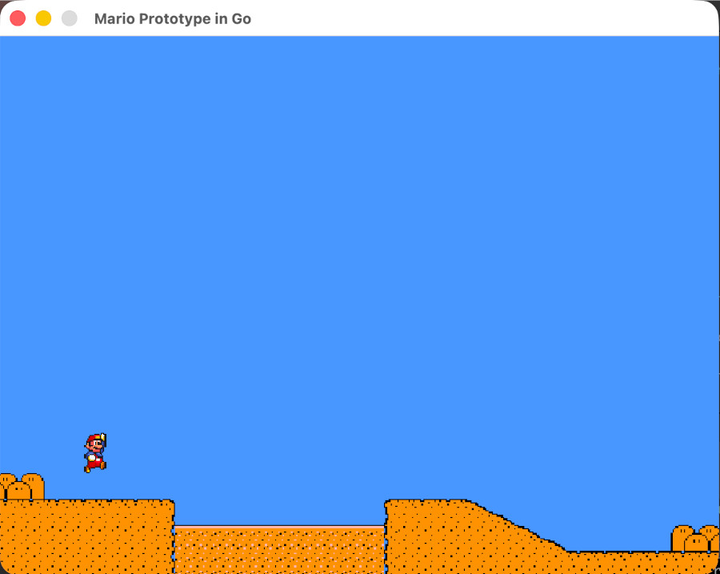

# Mario Prototype v1

[](https://godoc.org/github.com/jeffotoni/mario) [](https://goreportcard.com/report/github.com/jeffotoni/mario) [](https://github.com/jeffotoni/mario/blob/main/LICENSE)    

Mario Prototype v1 is an early platformer experiment built with **Go** and **Ebitengine**.

This repository is intentionally honest about its current state: it is **not a complete game yet**. It is the first playable prototype, focused on movement, jumping, and a simple scrolling scene.

---

## Status

This is the earliest project in the game collection.

Unlike Snake, Tetris, and Pong, this repository is still at the prototype stage. The current version is useful as a base for evolving a side-scrolling platformer, but it does not yet include complete gameplay rules.

Current completion level:

```text
v1 prototype: movement + jump + scrolling background
```

---

## Preview



---

## What Works Today

- Character movement to the left and right
- Jumping with gravity
- Simple ground physics
- Character flips direction when moving left/right
- Scrolling background/stage
- Desktop execution with `go run .`
- WebAssembly build support

---

## What Is Not Implemented Yet

- Enemies
- Platforms and block collisions
- Coins or collectibles
- Score system
- Lives or health system
- Win/lose flow
- Level progression
- Camera following a larger world
- Character animation states

---

## Requirements

- Go 1.22 or newer
- A modern browser with WebAssembly support for the browser version

---

## Quick Start

```bash
git clone https://github.com/jeffotoni/mario.git
cd mario
go run .
```

---

## Controls

| Action | Key |
|---|---|
| Move left | Arrow Left or A |
| Move right | Arrow Right or D |
| Jump | Space or Arrow Up |

---

## Run on Desktop

```bash
go run .
```

Build a local binary:

```bash
go build -o mario .
./mario
```

---

## Run in the Browser with WebAssembly

Build wasm:

```bash
GOOS=js GOARCH=wasm go build -o mario.wasm .
```

Serve the project folder:

```bash
python3 -m http.server 8080
```

Open:

```text
http://localhost:8080
```

---

## Project Layout

```text
.
├── assets/
│   ├── background.png
│   └── mario.png
├── wasm_exec/
│   └── wasm_exec.js
├── .gitignore
├── go.mod
├── go.sum
├── index.html
├── main.go
├── mario.jpeg
├── README.md
└── LICENSE
```

Generated files:

```text
mario
mario.wasm
```

These files are ignored by git.

---

## Development Roadmap

| Version | Focus |
|---|---|
| v1 | Basic movement, jump, and scrolling background |
| v2 | Camera movement and larger level bounds |
| v3 | Platform and block collision |
| v4 | Enemies and hazards |
| v5 | Coins, score, and collectibles |
| v6 | Game over and restart flow |
| v7 | First complete playable level |

---

## Why This Exists

The goal of this repository is to evolve a very small platformer step by step, keeping each milestone understandable.

This version is deliberately simple so the next iterations can focus on one gameplay layer at a time.

---

## Contributing

Contributions are welcome.

Good first areas to improve:

- Add a simple tile map.
- Add collision detection for platforms.
- Add a camera that follows the player.
- Add enemies or collectible items.
- Improve character animation.

---

## License

This project is open source under the **MIT License**.

Copyright (c) 2026 Jefferson Otoni Lima.

See [LICENSE](./LICENSE) for the full license text.
